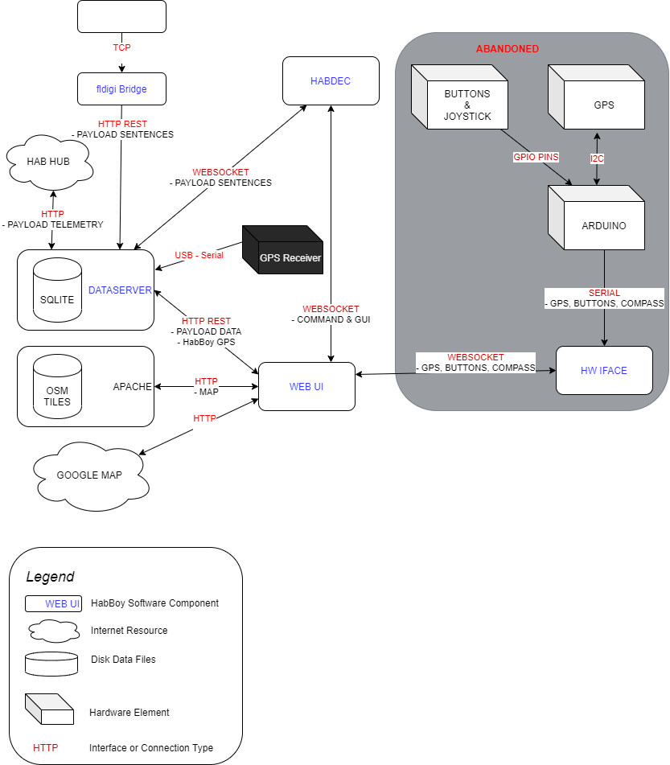

# HABBOY

HabBoy is a linux/webApp to help observe and chase after High Altitude Balloons. (https://ukhas.org.uk/)

https://www.youtube.com/watch?v=ZuoNf171e_A
https://twitter.com/froszu/status/1274308780923269120
https://twitter.com/froszu/status/1271166163993661440

## Features
* server backend for linux, python3 and SQLite
* web browser GUI - run it on any device (tablet,smartphone,desktop...)
* optimized for use in a car (large buttons, simple operation, 100% offline)
* read balloon telemetry from [HabDec](https://github.com/ogre/habdec/), [Habitat](https://habitat.habhub.org/), [dl-fldigi](https://ukhas.org.uk/projects:dl-fldigi)
* display Balloon position and landspot prediction on OpenStreetMap (offline vector tiles)
* display Balloon position on GoogleMaps (requires internet connection)
* display Balloons telemetry as graphs and gauges (HighCharts.js)

## Project Status
HabBoy is an experimental software, which means no guarantees are made. To make it run you probably need some code tinkering to adjust to your needs. Also, the installation is not an automatic process - you need to generate OSM vector tiles, install Apache (or other web server) and compile/install wind prediction software.

That being said, it was used in 3 HAB missions and performed very well.

It was developed and tested on SBCs like RaspberryPI(raspiOS) and OdroidXU4(Ubuntu 18.04).
For GPS location you need an USB receiver like this one: https://www.hardkernel.com/shop/usb-gps-module/

## Structure Overview
HabBoy is a multi component software:

### Components
* [data server](./data_server/README.md)
* [web browser UI](./webUI/README.md)
* [OpenStreetMap](./docs/VECTOR_TILES.md)
* [HabDec](https://github.com/ogre/habdec/)
* [fldigi bridge](./bridge/fldigi/README.md)

### discovery
* helper system to find HABBOY/HabDec in LAN without DNS and static IPs

### Now Defunct Components - this is unmaintained and depreciated
* [hw_iface](./hw_iface/README.md) - websocket interface to any external hardware (ie. arduino)
* [arduino](./arduino/README.md) - arduino code to read GPS data from uBLOX module

