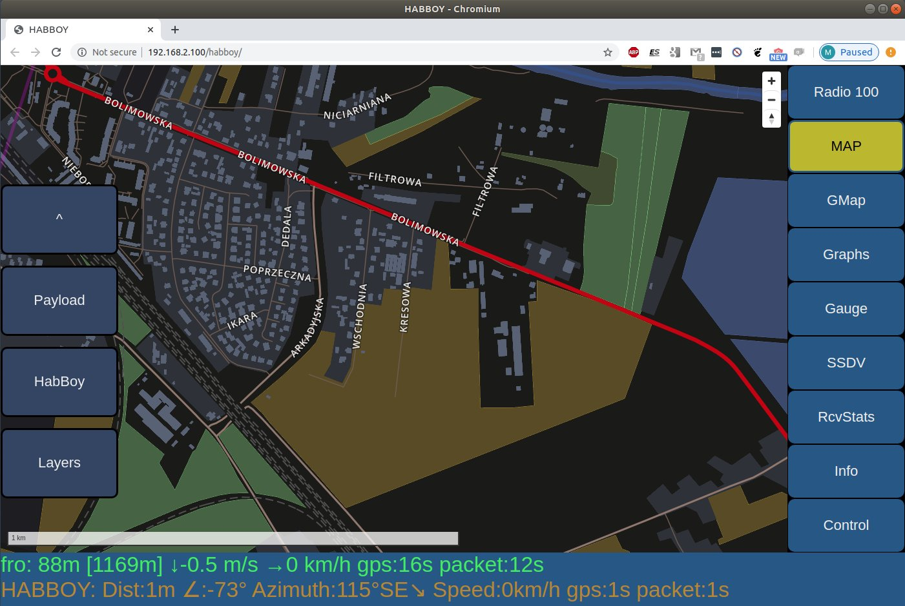

# OpenStreetMap Vector Tiles



To use Open Street Map in HabBoy, you need to generate vector tiles in MapBox format. It is recommended to use [tilemaker](https://github.com/systemed/tilemaker).

You can use [this repo](https://github.com/ogre/tilemaker_config) as guideline to tilemaker configuration and usage.

Folder ```tilemaker_config``` in this repo contains tilemaker configuration for HabBoy.

After successful generation of tiles, symlink tiles folder to correct webserver location. The exact URL at which tiles must be accesible is defined in file ```webUI/code/js/HB_map_style_default.js``` in ```var data_root = HABBOY_URL + "/osm/tiles";```.

For example:
```ln -s ~/osm /var/www/html/osm```
