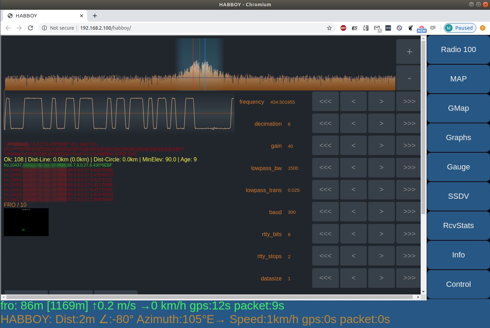

# webUI



```webUI``` is a HabBoy GUI in a web browser:
* connects to ```data_server``` for payload telemetry
* displays any nuber HabDec interfaces
* displays OSM map with payload and HabBoy location
* displays google map with navigation route
* displays graphs and gauges with telemetry using [highcharts.js](https://www.highcharts.com/)
* Displays Habitat SSDV

# Installation
```webUI``` should be server with any web server, ie. apache.
Opening ```index.html``` directly from disk might not work due to CORS restrictions.

For testing, you can start simple python server:
```
cd webUI/code
python -m http.server 80
```
Then open browser and go to http://localhost

For example, if you use apache:
```ln -s ~/habboy/webUI/code /var/www/html/habboy```

Web UI is then available under URL ```http://habboy/habboy```

# User Interface
User Interface is divided in two parts. At the bottom is ```status bar```.
Rest of the UI area is many tabs(Habdec, maps, etc.) that can be switched with buttons at right side of screen.

## Status Bar
```status bar``` is located at the bottom of the screen.

First line displays payload information:

* callsign
* altitude [max altitude]
* ascent rate m/s
* horizontal speed km/h
* GPS fix age (time since last GPS fix)
* last payload sentence age

Color of the payload line has meaning:
* green - 0-60 seconds age
* orange - 60-120 seconds age
* red - more than 120 seconds age

Second line displays information about HabBoy device:

* distance to payload
* payload elevation
* azimuth to payload
* HabBoy vehuicle speed km/h
* GPS fix age
* GPS packet age


## Tabs
Right side of screen is a column of buttons. Each button is a tab.
Custom tabs can be added by editing ```HABBOY.js``` file.

## Tab - HabDec
HabBoy can display multiple HabDec interfaces, one per radio/connection.
Each instance will have it's own TAB named ```Radio XXX```, where XXX is last octed of HabDec IP address.

To install HabDec into HabBoy, create symlink (or copy):
```
cd ./habboy_sw/webUI
ln -s ~/habdec/code/webClient ./habdec_gui
```

To add new habBoy TAB, open URL:
```http://habboy:8888/habboy/api/v1/habdec/add/192.168.1.100:5555```
Where 192.168.1.100:5555 is addr:port oh running habdec websocketServer.

## Tab - Map
```Tab Map``` is OpenStreetMap vetor tiles map with location of payload, HabBoy device and predicted land spot.

To work correctly you must:
* install cusf and wind data as described in [data_server](../data_server/README.md)
* prepare and install vector tiles as described [here](../docs/VECTOR_TILES.md)

## Tab - Google Maps

To enable, edit ```webUI\code\js\HB_google_map.js``` file and fill your google API key in ```GMAPS_API_KEY``` variable.

You can uncomment ```HG_GoogleMap_NavigationUpdate()``` function call to enable google navigation. This needs more work however and is a mere experiment now.

## Tab - Control
Various HabBoy settings.

### Nav
Copy payload lat,lon to clipboard

### Chase Car
Upload HabBoy GPS position to Habitat (as chasecar)

### Payloads...
Select payload to track. These are payloads saved in ```data_server``` DB.

### Device -> habdec_start / habdec_stop
start/stop HabDec daemon

### Device -> spy_start / spy_stop
start/stop SpyServer daemon

### Device -> restart
restart all daemons (habboy and habdec)

### Device -> reboot
reboot computer

### Device -> halt
stop computer

## Directory Structure
Below is an example dir structure of ```/var/www/html```

```
~  www tree -d -l -L 4 .
.
└── html
    ├── habboy -> /home/pi/share/dev/habboy/habboy_sw/webUI/code
    │   ├── css
    │   ├── habdec_gui -> /home/pi/share/dev/habdec/habdec/code/webClient
    │   │   ├── css
    │   │   └── js
    │   ├── img
    │   └── js
    │       └── highcharts
    ├── osm
    │   ├── font -> /home/pi/share/data/osm/font/klokantech/font
    │   │   ├── Klokantech Noto Sans Bold
    │   │   ├── ...
    │   │   └── Roboto Thin-Italic
    │   └── tiles -> /home/pi/share/data/osm/tiles
    │       ├── admin
    │       ├── aeroway
    │       ├── buildings
    │       ├── labels
    │       ├── landuse
    │       ├── roads
    │       └── water
    └── ssdv
        └── gallery
```